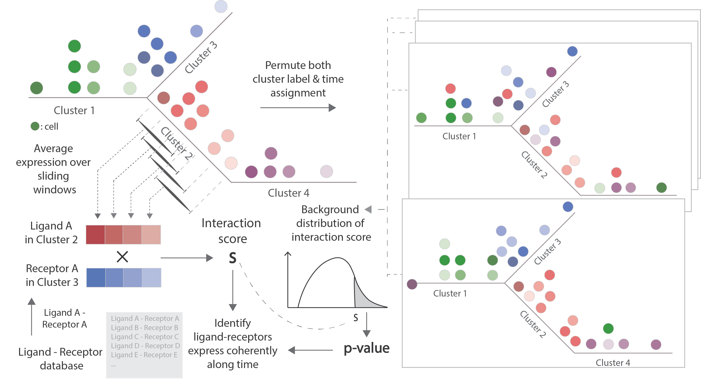

# Introduction
TraSig (**Tra**jectory-based **Sig**nalling genes inference) identifies interacting cell types pairs and significant ligand-receptors based on the expression of genes as well as the *pseudo-time ordering* of cells. For any two groups of cells that are expected to overlap in time, TraSig takes the pseudo-time ordering for each group and the expression of genes along the trajectory as input and then outputs an interaction score and p-value for each possible ligand-receptor pair. It also outputs a summary score for cell type pairs by combining individual ligand-receptors' scores. 



## Table of Contents
- [Get started](#Get&nbsp;started)
- [Command-line tools](#Command-line)

# Get started 
## Prerequisites 
* Python >= 3.6
* Python side-packages:   
-- numpy >= 1.19.5  
-- pandas >= 0.23.4  
-- Bottleneck >= 1.3.2  

## Installation 

### Install within a virtual environment 

It is recommended to use a virtural environment/pacakges manager such as [Anaconda](https://www.anaconda.com/). After successfully installing Anaconda/Miniconda, create an environment by following: 

```shell
conda create -n myenv python=3.6
```

You can then install and run the package in the virtual environment. Activate the virtural environment by: 

```shell
conda activate myenv
```

Make sure you have **pip** installed in your environment. You may check by 

```shell
conda list
```

If not installed, then: 

```shell
conda install pip
```

Then install TraSig, together with all its dependencies by: 

```shell
pip install git+https://github.com/doraadong/TraSig.git
```

### Not using virtural environment

If you prefer not to use a virtual envrionment, then you may install TraSig and its dependencies by (may need to use **sudo**): 

```shell
pip3 install git+https://github.com/doraadong/TraSig.git
```

You may find where the package is installed by:
 
```shell
pip show messi
```

# Command-line 

Run TraSig by (arguments are taken for example): 

```shell
messi -i ../input/ -o ../output/ -d merfish -g Female -b Parenting -c Excitatory -m train -c1 1 -c2 8 -e 5
```
The usage of this file is listed as follows:  

```shell
usage: messi [-h] -i INPUT [-ilr INPUT_LR] -o OUTPUT -d
             {merfish,merfish_cell_line,starmap} -g GENDER -b BEHAVIOR -c
             CELLTYPE -m MODE [-c1 NUMLEVEL1] [-c2 NUMLEVEL2] [-e EPOCHS]
             [-gs GRID_SEARCH] [-ns N_SETS] [-r NUMREPLICATES] [-p PREPROCESS]
             [-tr TOPKRESPONSES] [-ts TOPKSIGNALS]

optional arguments:
  -h, --help            show this help message and exit
  -i INPUT, --input INPUT
                        string, path to the input folder with the expression
                        data, default 'input/'
  -ilr INPUT_LR, --input_lr INPUT_LR
                        string, optional, path to the input folder with the
                        ligands and receptors list, default 'input/'
  -o OUTPUT, --output OUTPUT
                        string, path to the output folder, default 'output/'
  -d {merfish,merfish_cell_line,starmap}, --dataType {merfish,merfish_cell_line,starmap}
                        string, type of expression data, 'merfish' for MERFISH
                        hypothalamus data, 'merfish_cell_line' for MERFISH U-2
                        OS cells, 'starmap' for 'STARmap mPFC cells';default
                        'merfish'
  -g GENDER, --gender GENDER
                        string, gender of input animal sample, default
                        'Female', put 'na' if not available
  -b BEHAVIOR, --behavior BEHAVIOR
                        string, behavior of input animal sample, default
                        'Naive', put 'na' if not available
  -c CELLTYPE, --cellType CELLTYPE
                        string, cell type that will be built a model for, use
                        \ for white-space, e.g. 'OD\ Mature\ 2', default
                        'Excitatory'
  -m MODE, --mode MODE  string, any of 'train', 'CV'; if 'train', then all
                        data will be used for training and output a pickle
                        file for learned parameters; if 'CV', then cross-
                        validation will be conducted each time with an
                        animal/sample left out and each CV run output a pickle
                        file and prediction result, default 'train'
  -c1 NUMLEVEL1, --numLevel1 NUMLEVEL1
                        integer, optional, number of classes at level 1,
                        number of experts = number of classes at level 1 x
                        number of classes at level 2, default 1
  -c2 NUMLEVEL2, --numLevel2 NUMLEVEL2
                        integer, optional, number of classes at level 2,
                        default 5
  -e EPOCHS, --epochs EPOCHS
                        integer, optional, number of epochs to train MESSI,
                        default 20
  -gs GRID_SEARCH, --grid_search GRID_SEARCH
                        boolean, optional, if conduct grid search for hyper-
                        parameters, default False
  -ns N_SETS, --n_sets N_SETS
                        integer, optional, number of CV sets for grid search,
                        default 3
  -r NUMREPLICATES, --numReplicates NUMREPLICATES
                        integer, optional, number of times to run with same
                        set of parameters, default 1
  -p PREPROCESS, --preprocess PREPROCESS
                        string, optional, the way to include neighborhood
                        information; neighbor_cat: include by concatenating
                        them to the cell own features; neighbor_sum: include
                        by addinding to the cell own features; anything
                        without 'neighbor': no neighborhood information will
                        be used as features; 'baseline': only baseline
                        features; default 'neighbor_cat'
  -tr TOPKRESPONSES, --topKResponses TOPKRESPONSES
                        integer, optional, number of top dispersed responses
                        genes to model,default None (to include all response
                        genes)
  -ts TOPKSIGNALS, --topKSignals TOPKSIGNALS
                        integer, optional, number of top dispersed signalling
                        genes to use as features, default None (to include all
                        signalling genes)
```


# Credits
The software is an implementation of the method TraSig, jointly developed by Dora Li, [Jun Ding](https://github.com/phoenixding) and Ziv Bar-Joseph from [System Biology Group @ Carnegie Mellon University](http://sb.cs.cmu.edu/).  

# Contacts
* dongshul at andrew.cmu.edu 

# License 
This project is licensed under the MIT License - see the [LICENSE](LICENSE) file for details

